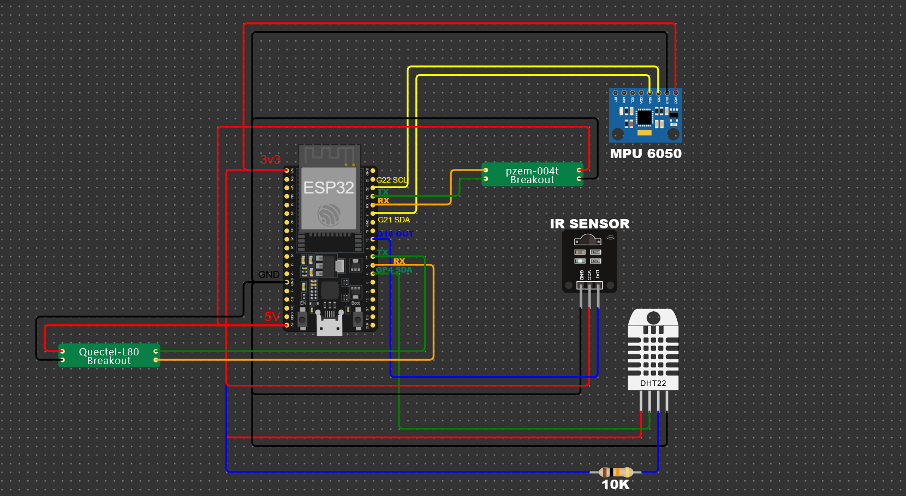

# Continuous Condition-Based Monitoring System of Motors

This project aims to monitor the condition of motors in real-time by collecting sensor data and using machine learning models to predict potential motor defects. The system integrates various sensors to capture motor performance parameters, sends the data to a website, where the machine learning model processes it to detect anomalies or defects. The results are displayed on the website for easy monitoring and early intervention.

## Features

- **Real-time Monitoring**: Continuously gathers data from various sensors.
- **Machine Learning Prediction**: Predicts motor health based on sensor data using an ML model.
- **Web Interface**: Displays motor condition and potential defects.
- **Modular Sensors**: Includes motion, temperature, humidity, and power monitoring sensors.
- **Remote Data Transmission**: Utilizes Wi-Fi to send data to the server for processing and visualization.

## Hardware Used

- **MPU6050**: Motion sensor to monitor vibration and movement.
- **DHT22**: Temperature and humidity sensor to capture environmental factors affecting the motor.
- **PZEM004Tv30**: Energy meter for monitoring voltage, current, and power consumption.
- **ESP32/Arduino**: Microcontroller for integrating sensors and sending data over Wi-Fi.

## Software Components

1. **Arduino Firmware**: Captures sensor data and sends it to the server.
   - Libraries used: `Adafruit_MPU6050`, `DHT`, `PZEM004Tv30`, `WiFi`, `HTTPClient`.
   - Data is sent to ThingSpeak (or a custom API) for analysis.

2. **Machine Learning Model**:
   - Developed in Python using a Jupyter Notebook (`SIH notebook.ipynb`).
   - Uses libraries such as `NumPy` and `Pandas` for data preprocessing and model training.
   - The model predicts motor health based on the sensor data.
   
3. **Website**:
   - Receives data from the server and shows the prediction results (defect/no defect).
   - Provides a user-friendly interface for real-time monitoring.

## Installation

### 1. Hardware Setup
- Connect the **MPU6050**, **DHT22**, and **PZEM004Tv30** sensors to the microcontroller (e.g., ESP32 or Arduino).
- Configure the microcontroller to connect to Wi-Fi by setting the SSID and password in the `FirstCode.ino` file:
  
    ```cpp
    const char* ssid = "your_ssid";
    const char* password = "your_password";
    ```

- Upload the code to your microcontroller.

### 2. Circuit Diagram



### 3. Software Setup
- Clone the repository and install the required Python libraries for the ML model:
  
    ```bash
    git clone https://github.com/yourusername/continuous-motor-monitoring.git
    cd continuous-motor-monitoring
    pip install -r requirements.txt  # Ensure the necessary libraries are included in this file
    ```

- Open the `SIH notebook.ipynb` in Jupyter to train and test the machine learning model.

### 4. Website
- Set up the website to receive sensor data and display predictions.
- Ensure the website is connected to the ML model to provide real-time motor condition status.

## Usage

1. Power on the hardware system.
2. The sensors will begin capturing data and send it to the server through Wi-Fi.
3. The server processes the data using the ML model and predicts motor health.
4. The website displays the results, indicating whether the motor is operating normally or if there is a defect.

## Example Output

Once the system is operational, the website will display something like:

```
Motor Status: Normal
Temperature: 35°C
Vibration Level: Low
Power Consumption: 500W
```

In case of an anomaly, the website will flag potential issues:

```
Motor Status: Defect Detected
Temperature: 45°C
Vibration Level: High
Power Consumption: 750W
```

## Contributing

1. Fork the repository.
2. Create your feature branch (`git checkout -b feature/AmazingFeature`).
3. Commit your changes (`git commit -m 'Add some AmazingFeature'`).
4. Push to the branch (`git push origin feature/AmazingFeature`).
5. Open a Pull Request.

## License

This project is currently under development, and we are in the process of applying for a patent. Until further notice, this project is not available for public use or distribution. Please contact the project maintainers for any inquiries or collaboration opportunities.
